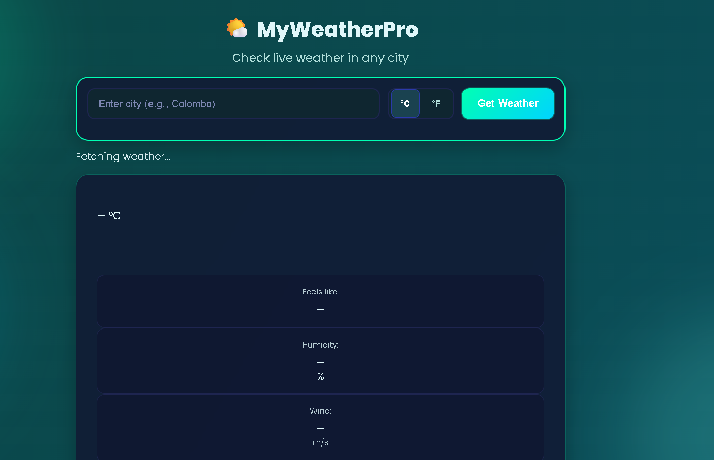
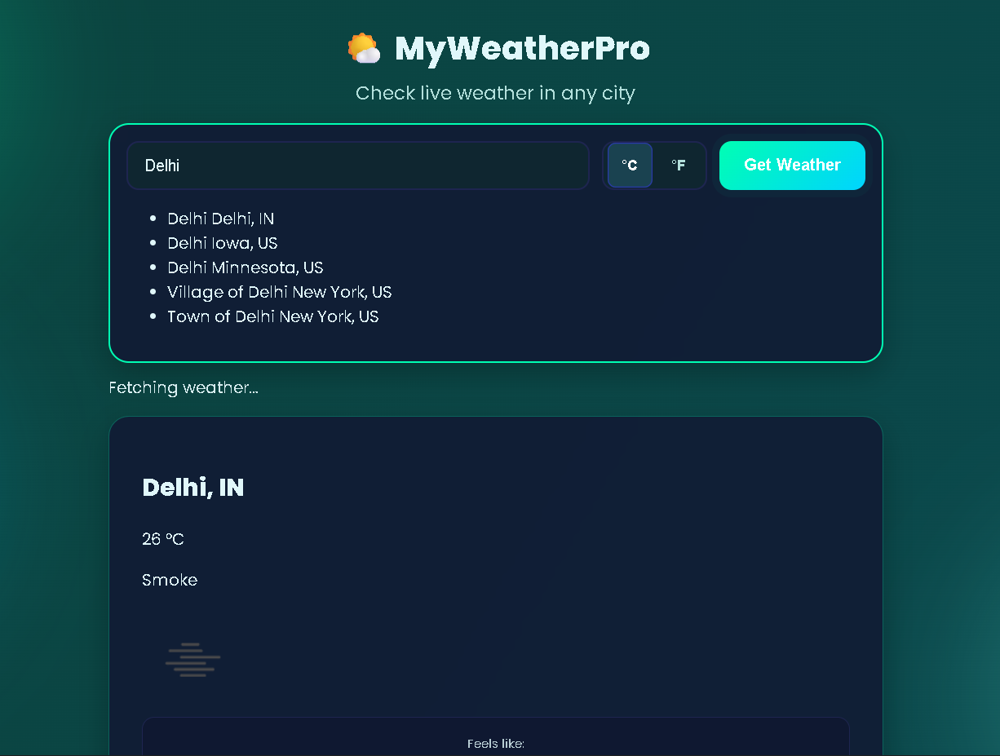
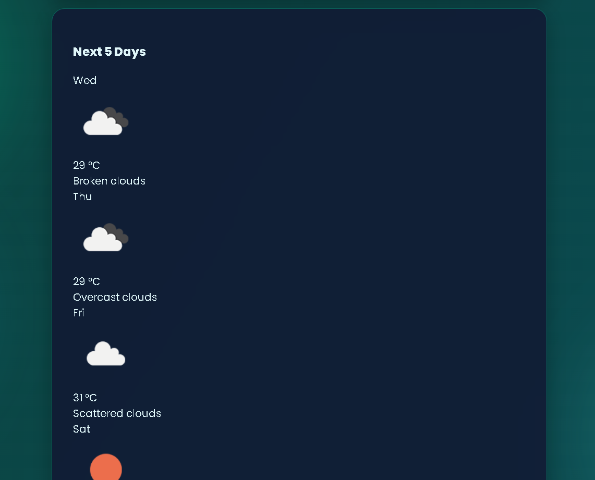

# Zahid's Weather App 🌤️

A modern, responsive weather application built with HTML, CSS, and JavaScript. Get the current weather and 5-day forecast for any city in the world. This project uses the **OpenWeatherMap API** to fetch live weather data.

---

## Features

- Search weather by city name
- Toggle between Celsius (°C) and Fahrenheit (°F)
- Display current weather details:
  - Temperature
  - Feels like
  - Humidity
  - Wind speed
  - Pressure
  - Visibility
  - Sunrise & Sunset times
- 5-day weather forecast
- Responsive design for mobile, tablet, and desktop
- Smooth UI animations and gradient backgrounds
- Accessible and optimized for high-contrast and reduced-motion users

---

## Screenshots

  <!-- Add your screenshot here -->
  <!-- Add your screenshot here -->
  <!-- Add your screenshot here -->

---

## Live Demo

You can view the live app [here](#)  <!-- Replace # with your GitHub Pages or hosted link -->

---

## Installation

1. Clone the repository:

```bash
git clone https://github.com/zahid-gulzar/weather-app.git
